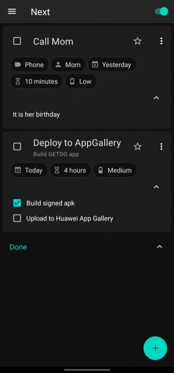
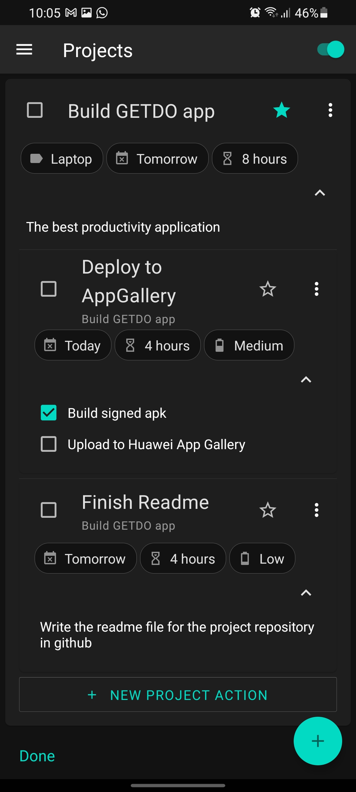
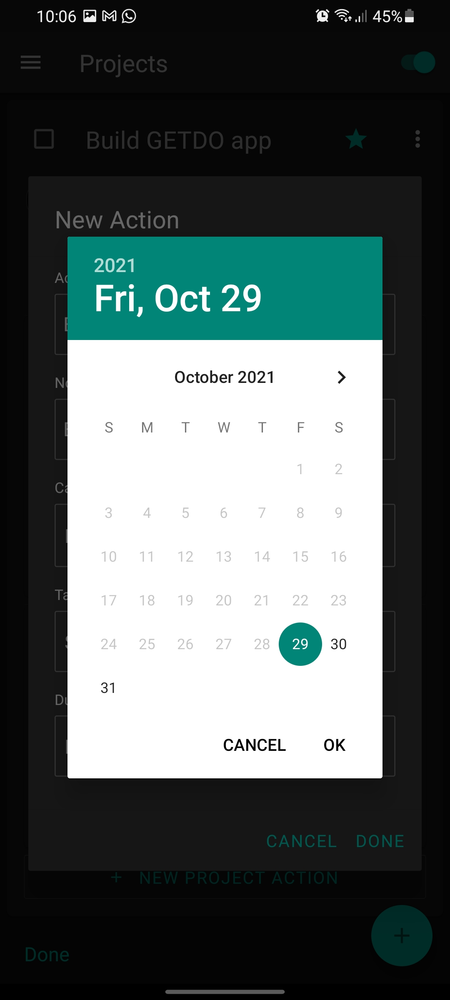
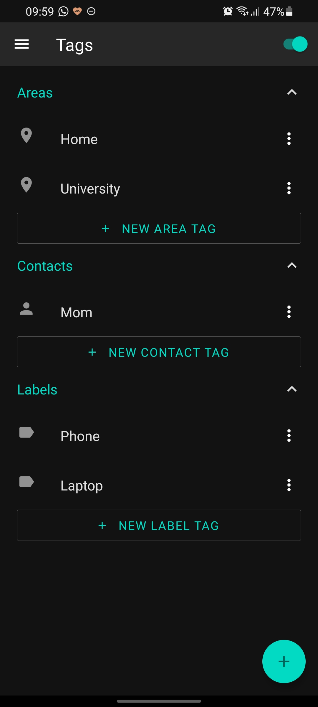
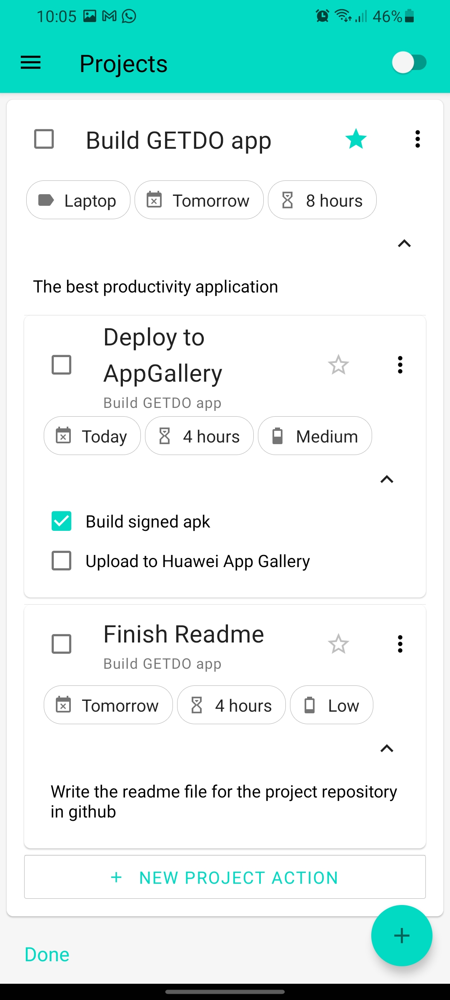
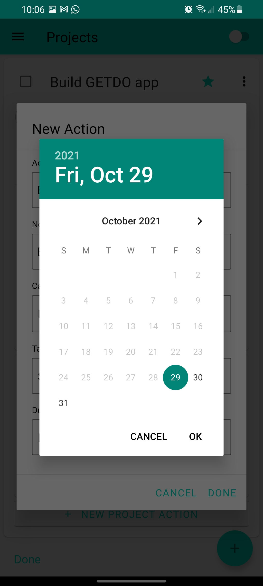
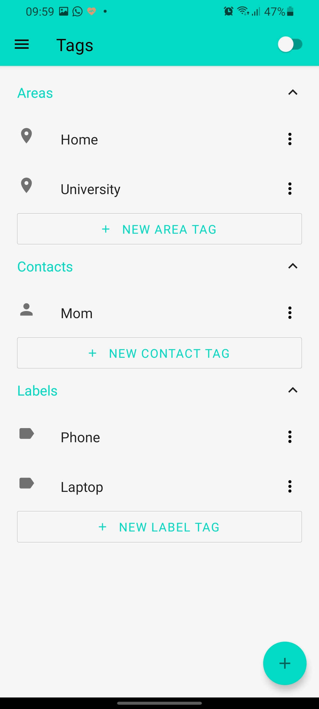

<p align="center">
 
</p>

<h2 align="center">GETDO</h2>

<div align="center">

  []() 
  [](https://github.com/crisemcon/Getdo)
  [](https://github.com/crisemcon/Getdo/pulls)
  [](/LICENSE)

</div>
<p align="center">
<a href="https://appgallery.huawei.com/app/C103698651">

</a>
<p>

---

<p align="center"> Task manager built for the Getting Things Done® productivity system, designed to help you capture, clarify, organize, reflect and engage your day to day.
    <br> 
</p>
<p align="center">

</p>


---
## 📝 Table of Contents
- [About](#about)
- [Built With](#built_with)
- [Getting Started](#getting_started)
- [Usage](#usage)
- [Screenshots](#screenshots)
<!--- [Deployment](#deployment)-->
<!--
- [TODO](../TODO.md)
- [Contributing](../CONTRIBUTING.md)
- [Authors](#authors)
- [Acknowledgments](#acknowledgement)
-->

---
## 🧐 About <a name = "about"></a>
GETDO is a mobile application designed to make Getting Things Done easy and sustainable. It has all the tools needed to follow the method, including projects, next actions lists, contexts, time and energy labels, areas, and more. Your data may be your valuable and sensitive personal information. This is why GETDO keeps your data on your device.

---
## ⛏️ Built With <a name = "built_with"></a>
- [React Native](https://reactnative.dev/) - Cross-platform Framework
- [React Navigation](https://reactnavigation.org/) - Routing and Navigation
- [React Native Paper](https://reactnativepaper.com/) - UI Components Library
- [Async Storage](https://github.com/react-native-async-storage/async-storage) - Key-value storage

---
## 🏁 Getting Started <a name = "getting_started"></a>
These instructions will get you a copy of the project up and running on your local machine for development and testing purposes.<!-- See [deployment](#deployment) for notes on how to deploy the project on a live system. -->


### Prerequisites

- Node.js - [Download & Install Node.js](https://nodejs.org/en/download/) and the npm package manager. If you encounter any problems, you can also use this [GitHub Gist](https://gist.github.com/isaacs/579814) to install Node.js.
- React Native Development Environment - [Check the official documentation](https://reactnative.dev/docs/environment-setup) and set up the React Native CLI development environment for Android and/or iOS.

<br>

### Installing

To install the dependencies, run this from the command-line:

```
npm install
```

For iOS development, navigate to the ios folder and run the following command:
```
pod install
```

For Android development, navigate to the android folder and run the following command:
```
./gradlew clean
```
If you get perimission errors, execute the following:
```
chmod +x ./gradlew 
```
<br>

### Running
To start the metro server run the following command in the root folder and keep the process running in a terminal.
```
npm start
```

#### iOS Device
Build and run the iOS application:

*If you have trouble building the app, open the GETDO.xcworkspace with XCode and build it from there*
```
npm run ios
```

#### Android Device
Build and run Android application:
```
npm run android
```

<!--
## 🔧 Running the tests <a name = "tests"></a>
Explain how to run the automated tests for this system.

### Break down into end to end tests
Explain what these tests test and why

```
Give an example
```

### And coding style tests
Explain what these tests test and why

```
Give an example
```
-->
---
## 🎈 Usage <a name="usage"></a>
If you are unfamiliar with the GTD productivity system, you can start by reading this [quick introduction](https://www.asianefficiency.com/task-management/gtd-intro/).

Here is a diagram that illustrates a common productivity workflow based on the Getting Things Done system:

<p align="center">
 
</p>

---
## 📷 Screenshots <a name="screenshots"></a>

### 🌑 Dark
<div>
    
    
    
</div>

<br>

### ☀️ Light
<div>
    
    
    
</div>

<!--## 🚀 Deployment <a name = "deployment"></a>
Add additional notes about how to deploy this on a live system.
-->


<!-- 
## ✍️ Authors <a name = "authors"></a>
- [@crisemcon](https://github.com/crisemcon)

See also the list of [contributors](https://github.com/kylelobo/The-Documentation-Compendium/contributors) who participated in this project. 

## 🎉 Acknowledgements <a name = "acknowledgement"></a>
- Hat tip to anyone whose code was used
- Inspiration
- References

-->